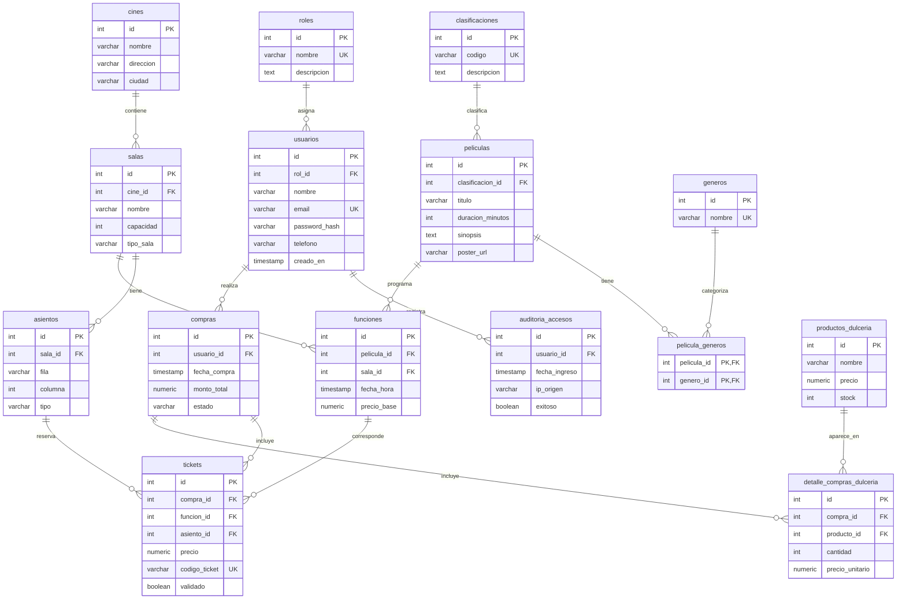

# 🎬 CineHub Sur — Sistema de Gestión de Cine

Proyecto de **Programación 5**. Aplicación web para gestionar un cine: cartelera,
reserva de asientos, dulcería, venta de boletas, validación de tickets por QR,
reportes y administración por roles.

## 🧱 Tecnologías

| Capa | Tecnología |
|------|------------|
| Frontend | Next.js 16 (App Router) · React 19 · Tailwind CSS 4 |
| Backend | Node.js · Express 5 · JWT (jsonwebtoken) · bcryptjs |
| Base de datos | PostgreSQL (Neon DB) |
| Autenticación | JWT + control de acceso por roles (RBAC) |

## 📁 Estructura del proyecto

```
CineHub/
├── backend/                 # API REST (Express)
│   ├── config/db.js         # Pool de conexión a PostgreSQL
│   ├── controllers/         # Lógica de cada recurso
│   ├── verificaciones/       # Verificación de JWT y roles
│   ├── routes/              # Definición de rutas por recurso
│   ├── scripts/initDb.js    # Ejecuta database/CineHub.sql
│   ├── .env.example         # Plantilla de variables de entorno
│   └── server.js            # Punto de entrada
├── frontend/                # App Next.js
│   └── src/
│       ├── app/             # Páginas (rutas del App Router)
│       ├── components/      # Componentes reutilizables (+ admin/)
│       ├── context/         # AuthContext (sesión global)
│       ├── lib/api.js       # Cliente HTTP central (token JWT)
│       └── services/        # Servicios por dominio
├── database/
│   ├── CineHub.sql          # Esquema + datos semilla (15 tablas)
│   └── Cine Hub DER.png     # Exportación antigua; el esquema vigente está abajo
└── docs/                    # PDF del proyecto y mockups de pantallas
```

## ✅ Requisitos

- Node.js 18 o superior
- Una base de datos PostgreSQL (el proyecto está pensado para Neon)

## 🚀 Puesta en marcha

### 1. Backend

```bash
cd backend
npm install
cp .env.example .env       # y completar DATABASE_URL y JWT_SECRET
npm run db:setup           # crea las tablas y carga los datos semilla
npm run dev                # inicia en http://localhost:5000
```

> ⚠️ `npm run db:setup` **borra y recrea** todas las tablas (ver los `DROP TABLE`
> al inicio de `database/CineHub.sql`). Úsalo solo para inicializar.

### 2. Frontend

```bash
cd frontend
npm install
cp .env.local.example .env.local   # opcional (por defecto usa localhost:5000)
npm run dev                        # inicia en http://localhost:3000
```

## 🔑 Usuarios de prueba

| Rol | Correo | Contraseña |
|-----|--------|------------|
| Administrador | admin@cinehub.com | admin123 |
| Empleado | empleado@cinehub.com | empleado123 |
| Cliente | cliente@cinehub.com | cliente123 |

## 👥 Roles y pantallas

| Rol | rol_id | Pantallas |
|-----|--------|-----------|
| Cliente | 1 | Cartelera (`/`), detalle de película, reserva, historial (`/historial`), dulcería |
| Empleado | 2 | Taquilla y validación (`/empleado`): validar ticket por QR y ver aforo |
| Administrador | 3 | Todo lo del Empleado + Panel Admin (`/admin`) |

## 🔌 Endpoints principales de la API

| Método | Ruta | Acceso | Descripción |
|--------|------|--------|-------------|
| POST | `/api/auth/registro` | Público | Registrar cliente |
| POST | `/api/auth/login` | Público | Iniciar sesión (devuelve JWT) |
| GET | `/api/auth/perfil` | Autenticado | Datos del usuario actual |
| GET | `/api/peliculas` | Público | Cartelera |
| GET | `/api/peliculas/:id` | Público | Detalle + funciones futuras |
| POST/PUT/DELETE | `/api/peliculas[/:id]` | Admin | CRUD de películas |
| GET | `/api/funciones` | Público | Funciones (`?todas=true` para incluir pasadas) |
| GET | `/api/asientos/funcion/:funcionId` | Público | Mapa de asientos de una función |
| POST | `/api/compras` | Autenticado | Registrar compra (boletas + dulcería) |
| GET | `/api/compras/usuario/:id` | Autenticado | Historial del usuario |
| GET | `/api/compras/:id/detalle` | Autenticado | Tickets (QR) y dulcería de la compra |
| GET/POST/PUT/DELETE | `/api/dulceria[/:id]` | GET público, resto Admin | Productos de dulcería |
| GET/POST/PUT/DELETE | `/api/salas[/:id]` | GET público, resto Admin | Salas (genera asientos) |
| GET | `/api/catalogos/generos` \| `/clasificaciones` \| `/roles` \| `/cines` | Público | Catálogos |
| POST | `/api/empleado/validar` | Empleado/Admin | Validar ticket por `codigo_ticket` |
| GET | `/api/empleado/aforo` | Empleado/Admin | Ocupación por función |
| GET | `/api/empleado/tickets?estado=pendientes\|validados\|todos` | Empleado/Admin | Lista tickets con su `codigo_ticket` para validarlos |
| GET | `/api/admin/usuarios` | Admin | Listar usuarios |
| POST/PUT/DELETE | `/api/admin/usuarios[/:id]` | Admin | CRUD de usuarios |
| GET | `/api/admin/reportes/ventas` | Admin | Ingresos y ventas |
| GET | `/api/admin/auditoria` | Admin | Últimos accesos |

## 🗄️ Esquema de la base de datos

El DDL completo, incluidas las restricciones y los datos semilla, está en
[`database/CineHub.sql`](database/CineHub.sql). Este diagrama refleja las 15 tablas
y sus relaciones:



`PK` indica clave primaria, `FK` clave foránea y `UK` valor único. La tabla
`pelicula_generos` usa una clave primaria compuesta (`pelicula_id`, `genero_id`);
`tickets` también impide vender dos veces el mismo asiento para una función con
la restricción única (`funcion_id`, `asiento_id`). El esquema SQL es la fuente
de verdad para restricciones, valores predeterminados y tipos con longitud o precisión.

## 📝 Notas

- El póster de las películas se obtiene de la columna `poster_url` (no `imagen_url`).
- La compra de boletas **requiere sesión**; si no hay token la API responde `401`.
- Los asientos tienen una restricción única `(funcion_id, asiento_id)` que evita
  vender dos veces el mismo asiento.
- Todos los archivos del proyecto están sujetos a cambios.
